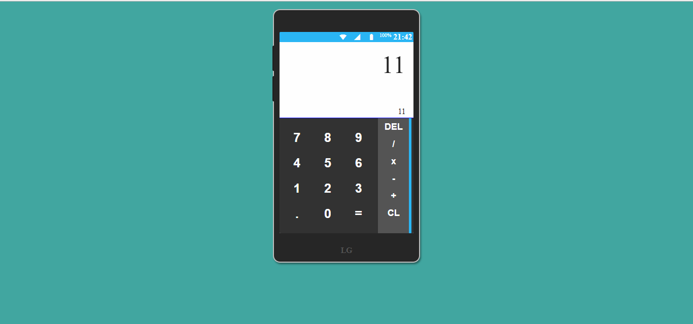

# Phone Calculator App

This app is part of freeCodeCamp frontEnd certificate
it was developed using vue.js and is live in codepen
[here](https://codepen.io/freesgen/pen/JOXGrW)

## User Stories

- User Story: I can add, subtract, multiply and divide two numbers.

- User Story: I can clear the input field with a clear button.

- User Story: I can keep chaining mathematical operations together until I hit the equal button, and the calculator will tell me the correct output.

# Build with

- vuejs
- Sass
- pug
